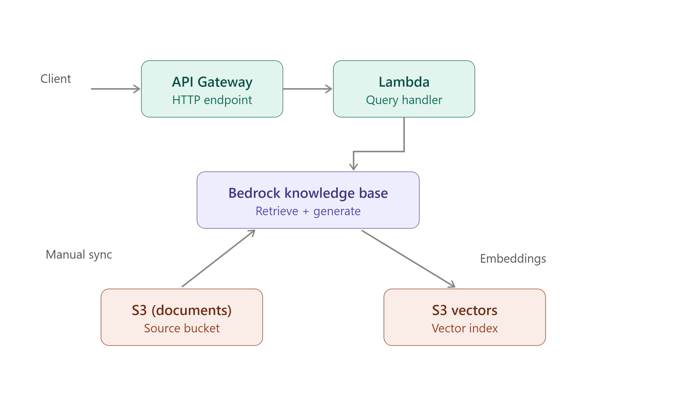

# rag-scaffold

A use-case-agnostic RAG baseline on AWS, built as a falsifiable scaffold:
every architectural decision is documented as an ADR with rejected
alternatives, and every claim of correctness is backed by a specific,
repeatable verification step, not asserted.



## Why this created?

This is the foundational commit for a portfolio of RAG projects targeting
AWS Certified AI Developer (AIP-C01), Domain 1. It is deliberately
minimal — seven essential services, no domain-specific logic, no VPC —
so that governance, observability, and security hardening can each land
as their own separately reviewable commit rather than being entangled with core infrastructure. 

See `docs/adr/` for why each service was chosen over its alternatives, and what was explicitly deferred.

## Architecture

- **S3 (documents)** — source bucket for raw content
- **S3 Vectors** — vector storage for the knowledge base
- **Bedrock Knowledge Base** — embedding + retrieval + generation
- **Lambda** — query handler, calls `RetrieveAndGenerate`
- **API Gateway (HTTP API)** — single `POST /query` route
- **IAM roles** (×2) — scoped to the Knowledge Base and the Lambda function

Ingestion is manual in this baseline (`StartIngestionJob` invoked directly) 
— see ADR 0003 for why, and ADR 0004 for the planned
automation.

## Quickstart

```bash
git clone https://github.com/vimalkrishna/rag-scaffold.git
cd rag-scaffold
uv sync
uv run cdk synth      # sanity check — should produce a template with no errors
uv run pytest
uv run cdk deploy
```

## Design decisions

Every non-obvious choice, vector store selection, why the query
interface shipped in commit 1, the manual ingestion trigger is recorded
as an ADR, including what was rejected and why:

→ [`docs/adr/`](docs/adr/)

## Verification

This baseline was validated against an 8-step test plan that isolates
each service by layer (console for state, CLI for behavior), so a
failure at any step narrows the fault to a specific boundary rather than
"something's wrong somewhere":

→ [`docs/testing/8-step-verification.md`](docs/testing/)

## Not yet included

Deliberately deferred to later, separately reviewable commits:

| Area | Status |
|---|---|
| Ingestion automation (S3 event trigger) | ADR 0004 — proposed |
| Observability (logging, tracing, metrics) | Not started |
| Bedrock Guardrails / governance | Not started |
| API authentication (Cognito/IAM authorizer) | Not started |
| KMS customer-managed keys | Not started |

## License

[ MIT ]